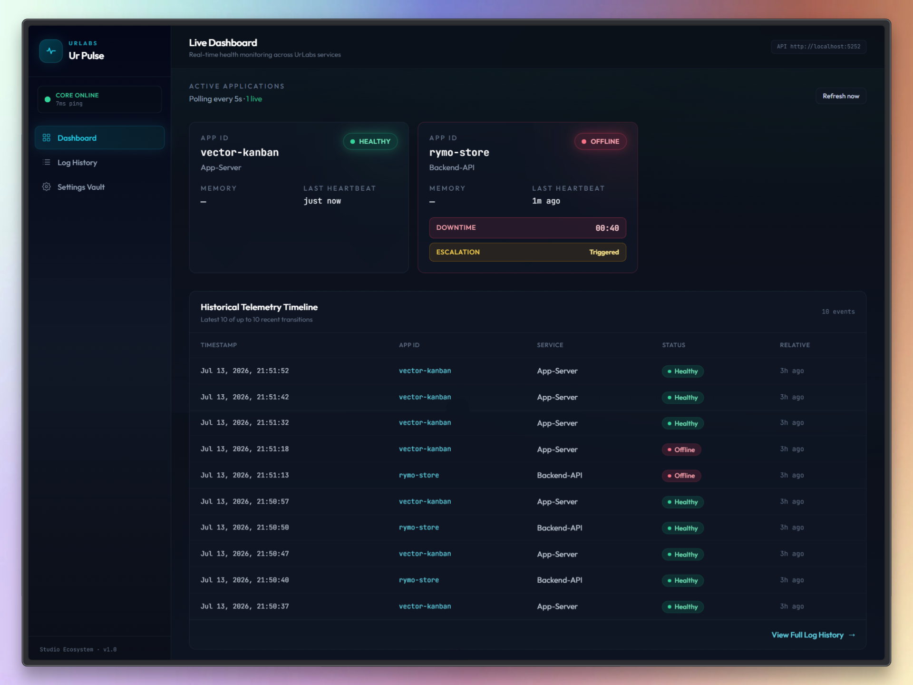

# Ur Pulse

**UrLabs · Centralized Dead Man's Switch & Infrastructure Heartbeat Monitor**

**Status: MVP complete**

Ur Pulse is the monitoring spine of the UrLabs studio ecosystem: a .NET Minimal API Core, a telemetry-only Client SDK, and a Nuxt operator dashboard. It delivers live service liveness, delayed multi-channel escalation, durable health history, and live-tunable global timing — without placing alert secrets on monitored hosts.



---

## What this MVP delivers

| Pillar | Behavior |
|--------|----------|
| **Dead Man's Switch** | Absence of heartbeat → Offline → (after delay) escalation |
| **Centralized Settings Vault** | One global `UrPulseSettings` block governs timing + alerting for **every** monitored app — no per-project secret wiring |
| **Plug & Play Auto-Discovery** | No server-side pre-registration: the first heartbeat registers the app automatically |
| **Server-authoritative timing** | Clients sync intervals via `GET /api/pulse/client-config` |
| **Server-side heartbeats only** | Monitored apps emit from their **server process**, never from the browser |
| **Unified alerting** | Telegram, Twilio, and local beep use one master credential set |
| **Live operator control** | Retune intervals at runtime via Settings UI — no Core restart |
| **Durable history** | Non-blocking EF Core → SQLite `UrPulseHealth.db` + paginated `/logs` |

**Solution layout:** `UrPulse.sln` — `src/UrPulse.Core`, `UrPulse.Client`, `UrPulse.Sample`, `UrPulse.Frontend`.

---

## 1. Philosophy

Distributed systems fail silently. Ur Pulse treats **silence** as failure, while still allowing clients to self-report `Degraded` when local resource ceilings are breached.

| Principle | Implementation |
|-----------|----------------|
| **Telemetry-only clients** | Identity, status, metadata only — never tokens or alert policy |
| **Centralized Settings Vault** | All timing and alert credentials live in one Core-owned `UrPulseSettings` vault — onboarding a new project does not require new secret entries |
| **Plug & Play Auto-Discovery** | First `POST /api/pulse/heartbeat` creates the live registry card; no whitelist or Core config change is required |
| **Core owns secrets & timing** | Telegram / Twilio / intervals live only in Core `UrPulseSettings` |
| **Server clock** | Liveness uses Core `DateTime.Now` at ingress; client clocks cannot skew status |
| **Two-phase failure** | Offline first, then escalation after a configurable delay |
| **Non-blocking I/O** | Alerts and EF Core writes run off the sweeper thread |

---

## 2. Architecture

```
Monitored Apps (server process only) — Plug & Play
  · UrPulse.Client (.NET)  or  raw HTTP heartbeats
  · First POST auto-registers {AppId}:{ServiceName}
        |
        |  GET  /api/pulse/client-config   (timing, no secrets)
        |  POST /api/pulse/heartbeat
        v
UrPulse.Core — PulseEngine (singleton, in-memory registry)
  · Centralized Settings Vault (UrPulseSettings) — one policy for all apps
  · Heartbeat interval / Offline threshold / Escalation delay / Scan cadence
  · Background EF Core → UrPulseHealth.db
        |
        ├── GET  /api/pulse/status
        ├── GET  /api/pulse/logs | /paginated | /{appId}
        └── GET/POST /api/settings/system
                |
                v
        UrPulse.Frontend (Nuxt)
          Dashboard · Log History · Global Settings
```

### Projects

| Project | Role |
|---------|------|
| **UrPulse.Core** | Minimal API, `PulseEngine`, global settings provider, SQLite health logs |
| **UrPulse.Client** | .NET timer emitter; syncs interval from Core `client-config` |
| **UrPulse.Sample** | Console crash-simulation harness |
| **UrPulse.Frontend** | Operator dashboard (live cards, connection gate, settings, logs) |

---

## 3. Global timing (source of truth)

Configured under `UrPulseSettings` in `appsettings.json` and the Settings page.  
**Rule:** `heartbeatInterval < offlineThreshold`.

| Setting | Default | Range | Meaning |
|---------|---------|-------|---------|
| `GlobalHeartbeatIntervalSeconds` | **10** | 5–60 | How often apps should POST heartbeats |
| `GlobalOfflineThresholdSeconds` | **20** | 5–300 | Silence longer than this → Offline |
| `GlobalEscalationDelaySeconds` | **30** | 0–600 | Time spent Offline before alerts fire |
| `GlobalScanIntervalSeconds` | **5** | 1–60 | How often PulseEngine re-evaluates liveness |

### Lifecycle

1. Heartbeats arrive → status `Healthy`
2. Silence exceeds offline threshold → status `Offline` (dashboard shows downtime)
3. Remains offline for escalation delay → `EscalationTriggered` + Telegram / Twilio / local beep
4. Next successful heartbeat → Healthy again; escalation flag resets

---

## 4. Core APIs

| Method | Path | Purpose |
|--------|------|---------|
| `POST` | `/api/pulse/heartbeat` | Ingress telemetry |
| `GET` | `/api/pulse/client-config` | Public timing contract (no secrets) |
| `GET` | `/api/pulse/status` | Live registry snapshot |
| `GET` | `/api/pulse/logs` | Recent transitions (dashboard preview) |
| `GET` | `/api/pulse/logs/paginated?page=&pageSize=` | Paginated history |
| `GET` | `/api/pulse/logs/{appId}` | Per-app history slice |
| `GET/POST` | `/api/settings/system` | Full global `UrPulseSettings` (includes secrets) |

**Client config response (example):**

```json
{
  "heartbeatIntervalSeconds": 10,
  "offlineThresholdSeconds": 20,
  "escalationDelaySeconds": 30,
  "scanIntervalSeconds": 5
}
```

---

## 5. Centralized Settings Vault (Global Configuration)

Ur Pulse is governed by a **single Centralized Settings Vault** — the `UrPulseSettings` block in Core `appsettings.json` (editable live via the Settings UI). Timing, escalation delay, and alert credentials are **global**: one configuration covers the entire fleet.

This replaces the previous per-application vault complexity. Linking a new project no longer means provisioning a dedicated Telegram/Twilio entry or a per-`AppId` secret section. Operators configure the vault once; every discovered app inherits the same policy immediately.

| Concern | Where it lives |
|---------|----------------|
| Heartbeat / offline / scan / escalation timing | `UrPulseSettings` (global) |
| `EnableAlerts`, `LocalAudioAlerts` | `UrPulseSettings` (global) |
| Telegram `BotToken` + `ChatId` | `UrPulseSettings.Telegram` (global) |
| Twilio voice credentials | `UrPulseSettings.Twilio` (global) |

Persisted by `LocalJsonSettingsProvider`. Legacy per-app vault (`UrVaultSimulation`) has been removed.

---

## 6. Plug & Play Auto-Discovery

**No pre-registration on the server is required.** The monitored project does not need an allowlist entry, a vault key, or any Core-side setup before going live.

1. Point the Client (or raw HTTP emitter) at Core and start posting heartbeats with an `appId` / `serviceName`.
2. On the **first successful pulse**, `PulseEngine` discovers the service, inserts it into the live in-memory registry, and surfaces a dashboard card.
3. Global vault timing and alerting apply automatically — zero additional configuration per project.

This is the commercial Plug & Play path for studio and multi-product fleets: ship the SDK (or heartbeat contract), emit once, and the service appears under monitoring.

**Hard rule:** heartbeats must come from the **server process** of the app under watch.  
Browser tabs must never POST heartbeats (background throttling causes false offline; open tabs cause false online after the server dies).

### Option A — .NET SDK

Reference `UrPulse.Client` and call `Start()`.  
The client syncs `heartbeatIntervalSeconds` from Core by default. First pulse → auto-discovered.

### Option B — Raw HTTP

1. Read timing from `GET /api/pulse/client-config`
2. Periodically `POST /api/pulse/heartbeat` with:

```json
{
  "appId": "my-app",
  "serviceName": "Api",
  "status": "Healthy",
  "metadata": {}
}
```

3. Stop posting when the server process stops — Core will mark offline, then escalate after the configured delay

No Core restart and no Settings change are required for a new `appId` to appear.
---

## 7. Persistence

`PulseEngine` writes health logs via `Task.Run` + a fresh DI scope:

- Entity: `HealthLog` (`Id`, `AppId`, `ServiceName`, `Status`, `Timestamp`, `HardwareMetricsJson`)
- Store: SQLite `UrPulseHealth.db`
- UI: capped timeline on Dashboard + full paginated history on `/logs`

**Note:** The live registry is **in-memory**. Restarting Core clears active cards until clients heartbeat again. Stale offline entries disappear on Core restart.

---

## 8. Operator Frontend

- Connection engine: loading / failed / connected with startup retries
- Dashboard: live cards (Healthy / Offline + Escalation badge) + timeline preview
- Log History: server-side pagination
- Settings: global timing + alerting credentials + client prefs (`dashboardLogLimit`, max retries)

```bash
# Core — http://localhost:5252
cd src/UrPulse.Core && dotnet run

# Dashboard — http://localhost:3000
cd src/UrPulse.Frontend && npm install && npm run dev
```

Optional: `NUXT_PUBLIC_API_BASE=http://localhost:5252`

---

## 9. Quick validation (MVP checklist)

1. Start Core, then Frontend — sidebar shows Core online; dashboard matches the screenshot above.
2. Run `UrPulse.Sample` (or any **new** server-side client with a fresh `appId`) — confirm Plug & Play: the card appears without any Core pre-registration.
3. Card stays Healthy; heartbeats refresh within the configured global interval.
4. Stop the **server process** (not just a browser tab) → Offline after offline threshold → Escalation after escalation delay (Telegram if vault alerts are enabled).
5. Restart the client process → Healthy again; Escalation badge clears.
6. In Settings (Centralized Vault), change heartbeat / offline / escalation values, save, confirm all clients pick up the new heartbeat interval within ~60s — no per-app retuning.
7. Confirm that browser open/close alone does **not** change app status.

---

## License & stewardship

Ur Pulse is developed under the **UrLabs** studio umbrella for internal and studio-ecosystem service reliability.
